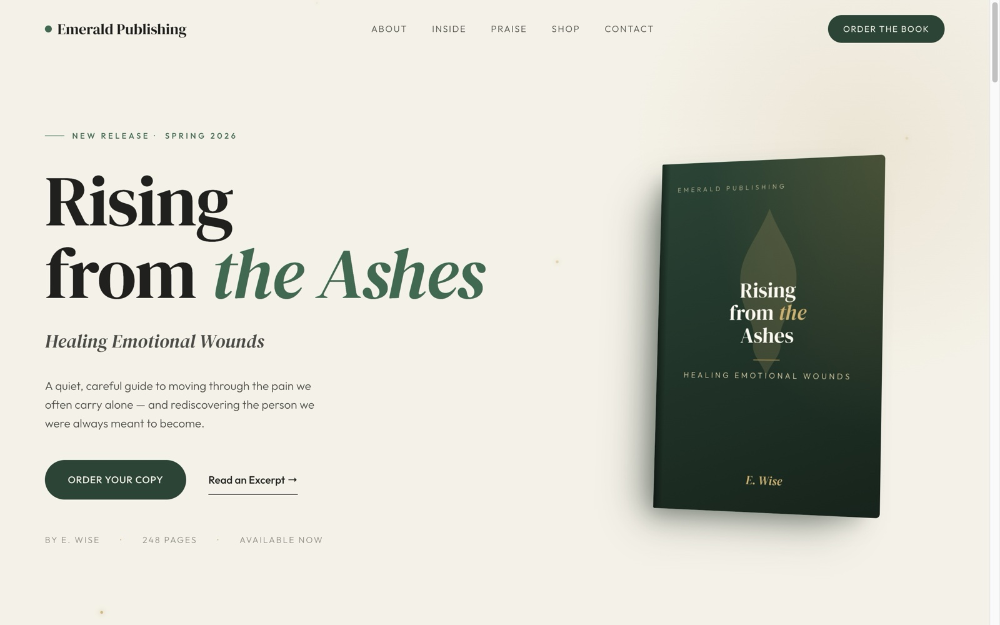
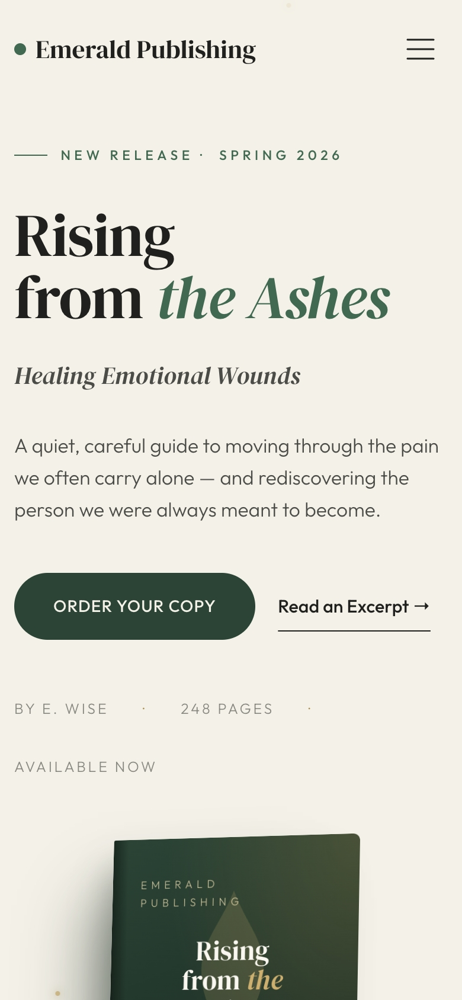
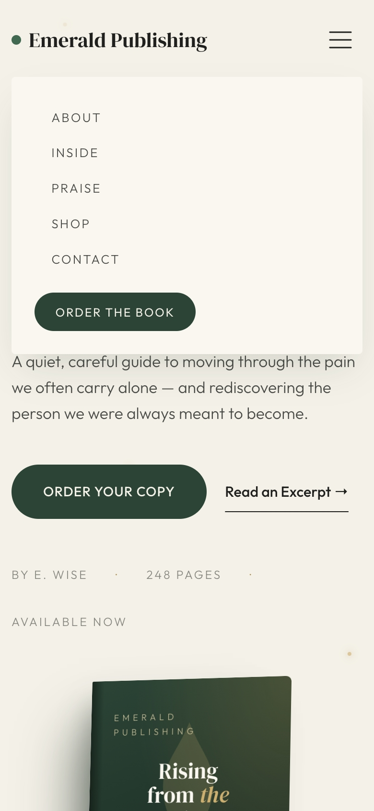

# Rising from the Ashes — Book Landing Page

A single-page marketing site for **_Rising from the Ashes_** by E. Wise, an upcoming self-help title from **Emerald Publishing**. The page introduces the author, previews the book's eight chapters, displays reader praise, and sells three editions — e-book, hardcover, and a limited autographed run.

**Live site:** https://emerald-pub.netlify.app/

> **Demo content.** This is a portfolio project. E. Wise is a fictional author, the book does not exist, and all reviewer profiles, emails, and addresses are fabricated. The contact-form phone placeholder uses the FCC-reserved `555-01XX` range. Editorial and press emails are not monitored.

---

## Screenshots

| Desktop — Hero | Desktop — Shop |
| :---: | :---: |
|  |  |

| Mobile — Hero | Mobile — Nav Open |
| :---: | :---: |
|  |  |

---

## Sections

- **Hero** — Title, tagline, CSS-rendered book cover, and floating ember particles.
- **About the Author** — Portrait and bio for E. Wise.
- **Inside the Book** — All eight chapters with short descriptions.
- **Praise** — Three reader reviews with avatars and 5-star ratings.
- **Shop** — Three editions (E-Book $14, Hardcover $29, Autographed $48).
- **Newsletter** — Email signup that promises the first chapter free (Netlify Forms).
- **Contact** — Editorial / press inquiries with a full contact form (Netlify Forms).
- **Footer** — Brand column, link columns, and social icons (Instagram, X, Goodreads, Substack).

---

## Tech Stack

- **HTML5** — semantic, accessible markup with skip link, ARIA labels, and proper landmarks.
- **CSS3** — custom styles in [css/styles.css](css/styles.css), built on Bootstrap 5's grid.
- **Bootstrap 5.3.3** — self-hosted at [css/vendor/bootstrap.min.css](css/vendor/bootstrap.min.css) for layout grid and the mobile nav collapse. Kept off the CDN to avoid a cross-origin round-trip on the critical path.
- **Vanilla JavaScript** — no framework, no build step. See [script.js](script.js).
- **Google Fonts** — DM Serif Display (display) + Outfit (body), loaded non-blocking.
- **Cloudinary** — image CDN for the author portrait, reviewer avatars, and edition images; `f_auto,q_auto` transforms on every URL.
- **Netlify** — static hosting and built-in form handling for the newsletter and contact forms.

---

## Features

- Sticky navbar that changes state on scroll
- Smooth-scroll anchor navigation with mobile menu auto-close
- Branded preloader that fades on page load
- Hero entrance animation, plus `IntersectionObserver`-driven reveals for the rest of the page
- Auto-formatted phone input — `(XXX) XXX-XXXX` as you type
- Floating ember particles in the hero
- Pure-CSS book cover (no image asset needed)
- Explicit `width`/`height` on images plus a responsive `srcset` on the hero portrait to minimize CLS
- Open Graph and Twitter Card meta tags for link previews
- SVG favicon embedded as a data URI

---

## Lighthouse

Desktop run against the live site (`npx lighthouse https://emerald-pub.netlify.app/ --preset=desktop`, 2026-04-23):

| Performance | Accessibility | Best Practices | SEO |
| :---: | :---: | :---: | :---: |
| **98** | **100** | **100** | **100** |

CLS = 0, TBT = 0 ms, LCP = 0.9 s. The small Performance deduction comes from ~31 KiB of unused Bootstrap CSS on the render-blocking stylesheet — a known tradeoff of loading the grid via CDN.

---

## Project Structure

```
emerald-pub/
├── index.html          # All page markup and section content
├── css/
│   ├── styles.css      # Custom styles (loaded after Bootstrap)
│   └── vendor/
│       └── bootstrap.min.css   # Bootstrap 5.3.3, self-hosted
├── script.js           # Nav, smooth scroll, preloader, reveals, phone format
├── docs/
│   └── screenshots/    # Desktop + mobile captures referenced in this README
└── README.md
```

---

## Running Locally

No build step. Open the file directly or serve the folder:

```bash
# Python
python3 -m http.server 8000

# Node
npx serve .
```

Then visit http://localhost:8000.

---

## Infrastructure & Services

### Netlify (hosting)

- Static hosting with **no build step** — there is no `netlify.toml`, `package.json`, or build command. Netlify serves `index.html` and its assets directly from the repo root.
- Continuous deploy from the `main` branch of [alphageekdom/product-landing-page](https://github.com/alphageekdom/product-landing-page).
- Live at https://emerald-pub.netlify.app/.

### Netlify Forms

- Two forms are wired up: **`newsletter`** (name + email) and **`contact`** (full press/editorial inquiry).
- Both declare `data-netlify="true"` with a honeypot (`data-netlify-honeypot="bot-field"`) and a matching hidden `bot-field` input.
- Submission is a **standard HTML form POST** — no `fetch()` or async handler in [script.js](script.js). On submit, Netlify's default success page is shown; there is no custom thank-you page or client-side success state.

### Cloudinary (image CDN)

- Cloud name: **`alphageekdom-dev`**. Hosts the author portrait, three reviewer avatars, three shop edition images (e-book / hardcover / autographed), and the Open Graph / Twitter card image.
- Transforms are used on every URL: `f_auto,q_auto` for format and quality, plus width variants (`w_300`/`w_500`/`w_800`/`w_1200`) and `c_fill,g_face` face-aware cropping on avatars.
- The hero author portrait is the only image with a responsive **`srcset`** (500w / 800w / 1200w); other images use a single transformed URL. A `preconnect` hint to `res.cloudinary.com` warms the connection ahead of first paint.
